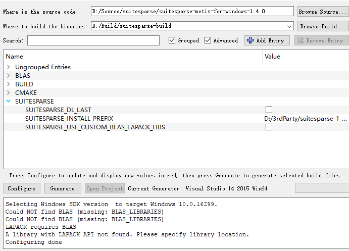
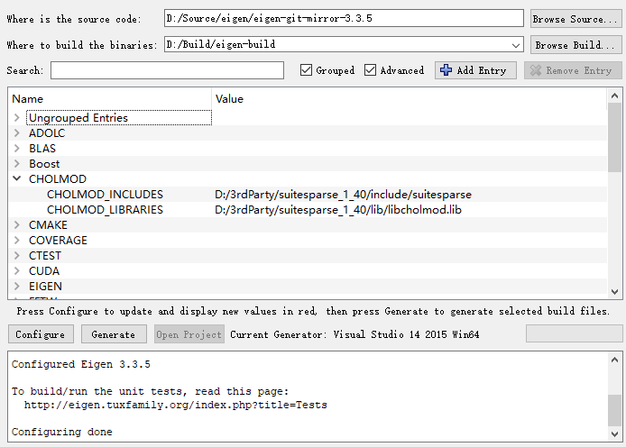
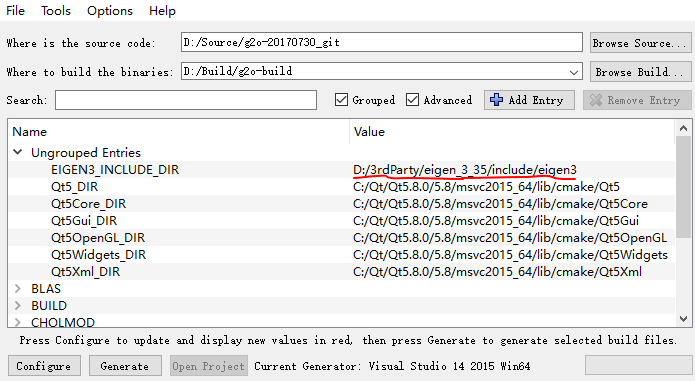
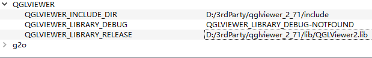
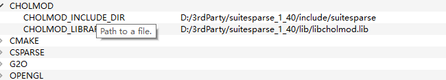
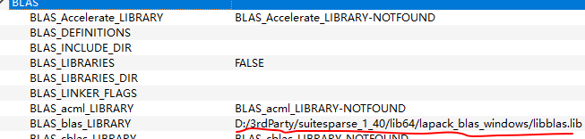
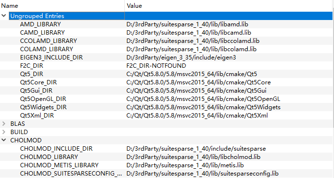
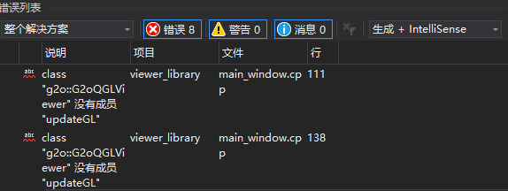
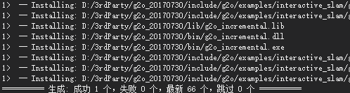

## 编译SuiteSparse
下载[suitesparse-metis-for-windows](https://github.com/jlblancoc/suitesparse-metis-for-windows/releases)，最新的版本为1.40，添加了对CUDA的支持，对应的SuiteSparse库的版本为5.1.2，SuiteSparse中包含了CHOLMOD库，因此我们需要首先编译SuiteSparse。
<!-- more -->
 1. 打开CMake配置工程，指定源码目录和工程构建目录，修改SUITESPARSE_INSTALL_PREFIX为自己的安装目录；例如：D:/3rdParty/suitesparse_1_40。依次点击Configure->Generate，生成VS工程。
 **注意**：VS2015编译1.31版本的SuiteSparse需要修改metis/GKlib/gk_arch.h文件，修改为：
```c
#ifdef __MSC__
/* MSC does not have rint() function */
#if (_MSC_VER < 1800)
#define rint(x) ((int)((x)+0.5))  
#endif
```
 2. 打开工程，依次生成ALL_BUILD和INTALL工程，将路径 `CMAKE_INSTALL_PREFIX\lib\lapack_blas_windows\` and `CMAKE_INSTALL_PREFIX\lib`添加到系统环境变量中。
## 编译Eigen
从[官网](http://eigen.tuxfamily.org/index.php?title=Main_Page)或者[Github](https://github.com/eigenteam/eigen-git-mirror)上下载源码，最新版本为3.35。
 1. CMake配置工程:指定源码目录和工程构建目录，修改CMake_INSTALL_PREFIX为自己的安装目录；例如：D:/3rdParty/cmake_3_35。依次点击Configure->Generate，生成VS工程。
 
 2. 打开工程，依次生成ALL_BUILD和INSTALL工程完成Eigen的安装
## 编译QGLViewer
从[libqglviewer官网](http://libqglviewer.com/)下载QGLViewer,用QtCreater或者VS(需要安装Qt VS Tools)打开libQGLViewer工程(.pro)。然后编译，完成后将生成dll路径加入到系统环境变量中。
## 编译G2O
从[GitHub](https://github.com/RainerKuemmerle/g2o)下载最新版本的G2O，CMake配置工程，指定源码目录和工程构建目录，修改CMake_INSTALL_PREFIX为自己的安装目录；
1. 指定EIGEN3_INLCUDE_DIR为Eigen的安装目录；指定QGLVIEWER的头文件目录和库文件


2. 指定CHOLMOD目录和库文件路径，指定BLAS库路径，然后点击Configure


3. 依次指定AMD和COLAMD等库路径，直到CMake选项不再变红。点击Generate生成工程

4. 打开G2O VS工程，生成ALL_BUILD项目，view_libray出现"updateGL"错误。

解决方法：将updateGL()替换为update()。重新编译，INSTALL完成安装。

