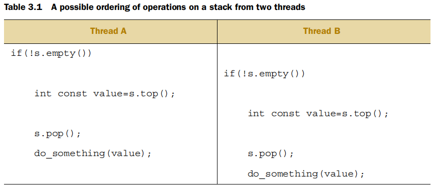

# 线程间数据共享问题
线程间的数据共享问题都是由于对数据的修改。如果所有共享的数据是只读的，就没有问题，因为一个线程读取的数据并不因为另外一个线程是否正在读取同样的数据而受影响。在并发中，任何输出结果依赖于两个或多个线程执行的相对顺序时就构成了竞争条件（race conditon)。C++标准定义了data race, 指由于同时对一个单一对象做修改而引起竞争条件的情况。

C++标准中保护共享数据最基本的机制是使用互斥变量mutex。在访问共享数据结构之前，对数据关联的互斥变量加锁lock，在完成访问数据后，进行解锁unlock。

## 使用互斥变量保护共享数据

C++中通过`std::mutex`来创建一个互斥量，通过`lock()`和`unlock()`函数来进行加锁和解锁。标准库提供了`std::lock_guard`，实现了互斥变量的RAII机制，构造时加锁，析构时解锁，从而避免手动进行加锁和解锁。

```
#include <list>
#include <mutex>
#include <algorithm>

std::list<int> some_list;
std::mutex some_mutex;

void add_to_list(int new_value)
{
    std::lock_guard<std::mutex> guard(some_mutex);
    some_list.push_back(new_value);
}
bool list_contains(int value_to_find)
{
    std::lock_guard<std::mutex> guard(some_mutex);
    return std::find(some_list.begin(), some_list.end(), value_to_find) != some_list.end();
}
```

### Stucturing code for protecting shared data

通常互斥量和共享数据作为类的私有成员变量，如果类的成员函数在访问数据成员时加锁，结束后解锁，数据可以很好地受到保护，但是对于返回保护数据指针或者引用的成员函数并不是这样，因为任何获取到数据指针或者引用的代码都可以在没有加锁的情况下访问保护数据。

```
class some_data
{
    int a;
    std::string b;
public:
    void do_something();
};

class data_wrapper
{
private:
    some_data data;
    std::mutex m;
public:
    template<typename Function>
    void process_data(Function func)
    {
        std::lock_guard<std::mutex> l(m);
        func(data);
    }
};

some_data* unprotected;

void malicious_function(some_data& protected_data)
{
    unprotected=&protected_data;
}

data_wrapper x;

void foo()
{
    x.process_data(malicious_function);
    unprotected->do_something();
}
```
不要在锁的作用域范围之外传递保护数据的指针和引用，不管是通过从一个函数返回，在外部显示内存存储，或者作为参数传递给用户提供的函数

### Spotting race conditons inherent in interface

考虑stack类，有五个操作`push()`，`pop()`,`top()`,`empty()`,`size()`。如果你更改`top()`返回一个复制而不是引用，并用互斥量来保护内部数据，这个接口仍然会有竞速条件问题。
当stack实例不是共享时，检查`empty()`然后调用`top()`获取栈顶元素是安全的：

```
stack<int> s;
if(!s.empty())
{
    int const value = s.top();
    s.pop();
    do_something(value);
}
```

当stack对象是共享时，这个调用顺序就不再是安全的了，在调用`empty()`和`top()`之间，另一个线程可能调用`pop()`移除最后一个元素。在top()和pop()调用直接也存在潜在的竞速条件。一个可能的执行顺序如下：

在两个`top()`中间没有操作修改stack，两个线程返回的`top()`值是一样的，在两个`pop()`中间也没有调用`top()`，结果就是栈上两个值的其中一个在没有被读取的情况下被丢弃了。正是由于top和pop()操作分离的设计导致了竞争条件。

#### Option 1: Pass In A REFERENCE

第一个选择是传递一个变量的引用作为pop()函数的参数
```
std::vector<int> result;
some_stack.pop(result);
```
缺点：需要在调用之前构造栈类型对象

#### Option 2: Require a no-throw copy constructor or move constructor

`pop()`操作只有以传值方式返回抛出异常这一种异常安全问题。许多类型的复制构造函数不抛出异常，具有移动构造函数的类型也不抛出异常即使其复制构造函数抛出异常。

#### Option 3： Return a pointer to the popped item

第三种方式是返回一个弹出项的指针而不是返回值，优点是指针可以自由拷贝而不抛出异常

#### Option 4: Provide both Option 1 and either option 2 or 3

提供给用户选择最合适的选项的能力
线程安全的stack类

```
#include <exception>
#include <memory>
#include <mutex>
#include <stack>

struct empty_stack : std::exception
{
    const char* what() const throw();
};

template<typename T>
class threadsafe_stack
{
private:
    std::stack<T> data;
    mutable std::mutex m;
public:
    threadsafe_stack(){}
    threadsafe_stack(const threadsafe_stack& other)
    {
        std::lock_guard<std::mutex> lock(m);
        data=other.data;
    }
    threadsafe_stack& operator=(const threadsafe_stack&) = delete;

    void push(T new_value)
    {
        std::lock_guard<std::mutex> lock(m);
        data.push(new_value);
    }

    std::shared_ptr<T> pop()
    {
        std::lock_guard<std::mutex> lock(m);
        if(data.empty()) throw empty_stack();
        std::shared_ptr<T> const res(std::make_shared<T>(data.top()));
        data.pop();
        return res;
    }

    void pop(T& value)
    {
        std::lock_guard<std::mutex> lock(m);
        if(data.empty()) throw empty_stack();
        value = data.top();
        data.pop();
    }

    bool empty() const
    {
        std::lock_guard<std::mutex> lock(m);
        return data.empty();
    }
};
```

## 死锁

两个线程需都要对两个互斥量加锁来执行某些操作，每个线程都有一个互斥量，等待另一个释放自己的互斥量，这种情况叫做死锁。避免死锁的通常建议是始终按相同的顺序对两个互斥量加锁。但是有些时候并不是那么简单，考虑交换同一个类的两个实例的数据时，为了确保数据不被并发修改影响正确交换，两个实例的互斥量都需要加锁，这种情况下顺序加锁就会出现死锁现象。`std::lock`可以同时对两个或多个互斥量加锁避免死锁风险。

```
class some_big_object;
void swap(some_big_object& lhs, some_big_object& rhs);

class X
{
private:
    some_big_object some_detail;
    std::mutex m;
public:
    X(some_big_object const& sd):some_detail(sd){}

    friend void swap(X& lhs, X& rhs)
    {
        if(&lhs==&rhs)
            return;
        std::lock(lhs.m, rhs.m);
        std::lock_guard<std::mutex> lock_a(lhs.m, std::adopt_lock);
        std::lock_guard<std::mutex> lock_b(rhs.m, std::adopt_lock);
        swap(lhs.some_detail, rhs.some_detail);
    }
};
```

`std::adopt_lock` 参数是为了告诉`std::lock_guard`对象互斥量已经被加锁，只需要获取互斥量上锁的所有权，而不用在构造函数里对互斥量加锁。

### 避免死锁的指导原则

#### 避免嵌套锁
如果你已经拥有一个锁不要再获取另一个，如果需要获取多个锁，使用`std::lock`执行一次动作获取。

#### 拥有一个锁时避免调用用户提供的代码
如果代码是用户提供的，你不知道它做了什么，可能包括获取一个锁。

#### 以固定顺序获取锁
如果确实需要获取两个或多个锁，又不能用std::lock一次操作获取，最好的方式是在每个线程中按相同的顺序获取。代价是不允许反向遍历

#### 使用锁分层结构
思想是把你的应用划分到各个层里，并确定在任何给定层可能被加锁的互斥量。当代码试图对互斥量加锁时，如果已经从低层拥有一个锁，就会禁止它对互斥量加锁。

```
hierarchical_mutex high_level_mutex(10000);
hierarchical_mutex low_level_mutex(5000);

int do_low_level_stuff();
int low_level_func()
{
    std::lock_guard<hierarchical_mutex> lk(low_level_mutex);
    return do_low_level_stuff();
}

void high_level_stuff(int some_param);

void high_level_func()
{
    std::lock_guard<hierarchical_mutex> lk(high_level_mutex);
    high_level_stuff(low_level_func());
}

void thread_a()
{
    high_level_func();
}

hierarchical_mutex_othre_mutex(100);
void do_other_stuff();

void other_stuff()
{
    high_level_func();
    do_other_stuff();
}

void thread_b()
{
    std::lock_guard<hierarchical_mutex> lk(other_mutex);
    other_stuff();
}
```

`thread_a()`遵循这个规则，可以正常运行。`thread_b()`没有遵循规则，首先，它对`other_mutex`这个100的低层级互斥量加锁。当`other_stuff()`调用`high_level_func()`时，违法了层级规则：`high_level_func()`试图获取`high_level_mutex`,它的层级值（10000）比当前的层级值(100)要高。`hierarchical_mutex`将会报告一个错误，抛出异常或终止程序。

```
class hierarchical_mutex
{
    std::mutex internal_mutex;
    unsigned long const hierarchy_value;
    unsigned long previous_hierarchy_value;
    static thread_local unsigned long this_thread_hierarchy_value;

    void check_for_hierarchy_violation()
    {
        if(this_thread_hierarchy_value <= hierarchy_value)
        {
            throw std::logic_error("mutex hierarchy violated);
        }
    }
    void update_hierarchy_value()
    {
        previous_hierarchy_value = this_thread_hierarchy_value;
        this_thread_hierarchy_value = hierarchy_value;
    }
public:
    explicit hierarchical_mutex(unsigned long value):
        hierarchy_value(value),
        previous_hierarchy_value(0)
    {}

    void lock()
    {
        check_for_hierarchy_violation();
        internal_mutex.lock();
        update_hierarchy_value();
    }
    void unlock()
    {
        this_thread_hierarchy_value=previous_hierarchy_value;
        internal_mutex.unlock();
    }
    bool try_lock()
    {
        check_for_hierarchy_violation();
        if(!internal_mutex.try_lock())
            return false;
        update_hierarchy_value();
        return true;
    }
};
thread_local unsigned long hierarchical_mutex::this_thread_hierarchy_value(ULONG_MAX);
```

## std::unique_lock

`std::unique_lock`比`std::lock_guard`提供了更多地灵活性；`std::unique_lock`实例并不是一直拥有与它关联的互斥量。首先，你可以传递`std::adopt_lock`作为第二个参数给构造函数使锁对象管理互斥量上的锁，你也可以传递`std::defer_lock`作为第二个参数来指示互斥量应该在构造时保持解锁状态。通过在`std::unique_lock`对象上调用`lock()`或者传递`std::unique_lock`对象给`std::lock()`来进行加锁。

```
class some_big_object;
void swap(some_big_object& lhs, some_big_object& rhs);
class X
{
private:
    some_big_object some_detail;
    std::mutex m;
public:
    X(some_big_object const& sd):some_detail(sd){}

    friend void swap(X& lhs, X& rhs)
    {
        if(&lhs==&rhs)
            return;
        std::unique_lock<std::mutex> lock_a(lhs.m, std::defer_lock);
        std::unique_lock<std::mutex> lock_b(rhs.m, std::defer_lock);
        std::lock(lock_a, lock_b);
        swap(lhs.some_detail, rhs.some_detail);
    }
}
```

`std::unique_lock`会在内部存储一个是否拥有锁的标志，`std::unique_lock`对象会比`std::lock_guard`大，而且需要更新或检查标志位。如果`std::lock_guard`满足需求，建议使用`std::lock_guard`。
## 在不同作用域转移互斥量的所有权
由于`std::unique_lock`实例并不是一定拥有他们关联的互斥量，互斥量的所有权可以通过moving来在实例间转换。
如果是从函数返回一个实例，这种转换是自动的，其他情况你需要显示调用`std::move()`，这取决于变量是左值(一个真正变量）还是右值（临时变量），右值自动转换，左值需要显示转换。`std::unique_lock`可以movable但不可以copyable。

```
std::unique_lock<std::mutex> get_lock()
{
    extern std::mutex some_mutex;
    std::unique_lock<std::mutex> lk(some_mutex);
    prepare_data();
    return lk;
}
void process_data()
{
    std::unique_lock<std::mutex> lk(get_lock());
    do_something();
}
```

## 选择合适的加锁粒度

一个细粒度的锁保护数据的一小部分，一个粗粒度的锁保护数据的一大部分。既需要选择合适的粗粒度锁来确保数据受保护，又需要确保只有实际访问共享数据的时候锁才被持有。

```
void get_and_process_data()
{
    std::unique_lock<std::mutex> my_lock(the_mutex);
    some_class data_to_process=get_next_data_chunk();
    my_lock.unlock();
    result_type result = process(data_to_process);
    my_lock.lock();
    write_result(data_to_process, result);
}
```

你不需要在调用`process()`时对互斥量加锁，所以在`process()`之前进行解锁，在write_result之前进行加锁。

```
class Y
{
private:
    int some_detail;
    mutable std::mutex m;
    
    int get_detail() const
    {
        std::lock_guard<std::mutex> lock_a(m);
        return some_detail;
    }
public:
    Y(int sd):some_detail(sd){}

    friend bool operator==(Y const& lhs, Y const& rhs)
    {
        if(&lhs==&rhs)
            return true;
        int const lhs_value=lhs.get_detail();
        int const rhs_value=rhs.get_detail();
        return lhs_value==rhs_value;
    }
}
```

值得注意的是，虽然降低了锁的周期，每次只拥有一个锁，这其实改变了比较操作的语义，这里操作符返回true代表某一时刻lhs.some_detail的值等于另一时刻rhs.some_detail的值。

## 保护共享数据的其他方式
互斥量并不是唯一保护共享数据的方式；一种特殊的情况是共享数据只需要初始化时对并发访问进行保护，之后并不需要显式同步。这种情况对初始化后的数据进行加锁不是必要的而且对性能会有影响。

### 初始化时保护共享数据
利用mutex实现线程安全的延迟初始化

```
std::shared_ptr<some_resource> resource_ptr;
std::mutex resource_mutex;
void foo()
{
    std::unique_lock<std::mutex> lk(resource_mutex); // all threads are serialized here
    if(!resource_ptr)
    {
        resource_ptr.reset(new some_resource); // only the initialization needs protection
    }
    lk.unlock();
    resource_ptr->do_something();
}
```
为了检查资源是否已经被初始化，每个线程都需要等待互斥量。另一种实现是Double-Checked Locking模式,但是
会导致未定义行为，因为锁范围之外的读取并没有与锁内部由另一线程的写入操作同步。
```
void undefined_behaviour_with_double_checked_locking()
{
    if(!resource_ptr) // 1
    {
        std::lock_guard<std::mutex> lk(resource_mutex);
        if(!resource_ptr) // 2
        {
            resource_ptr.reset(new some_resource); // 3
        }
    }
    resource_ptr->do_something(); // 4
}
```
C++标准库提供了`std::once_flag`和`std::call_once`来处理这种情况
```
std::shared_ptr<some_resource> resource_ptr;
std::once_flag resource_flag;

void init_resource()
{
    resource_ptr.reset(new some_resource);
}

void foo()
{
    std::call_once(resource_flag, init_resource);
    resource_ptr->do_something();
}
```
`std::once_flag`和`std::call_once()`同样可以作为类成员的延迟初始化。
```
class x
{
private:
    connection_info connection_details;
    connection_handle connection;
    std::once_flag connection_init_flag;

    void open_connection()
    {
        connection=connection_managger.open(connection_details);
    }
public:
    X(connection_info const& connection_details_)
    : connection_details(connection_details_)
    {}
    void send_data(data_packet const& data)
    {
        std::call_once(connection_init_flag, &X::open_connection, this);
        connection.send_data(data);   
    }
    data_packet receive_data()
    {
        std::call_once(connection_init_flag, &X::open_connection, this);
        return connection.receive_data();
    }
};
```

### 保护很少更新的数据结构

有些数据结果很少进行更新但偶尔又需要更新，比如DNS条目。更新操作需要线程独占数据结构直到完成更新，一旦更新完成，多个线程又可以安全地并发访问。这时用std::mutex就会丧失在不进行修改数据时，并发读取数据结构的能力。这时可以选择`boost::shared_mutex`，和`boost::shared_lock<boost::shared_mutex>`。

```
#include <map>
#include <string>
#include <mutex>
#include <boost/thread/shared_mutex.hpp>

class dns_entry;

class dns_cache
{
    std::map<std::string, dns_entry> entries;
    mutable boost::shared_mutex entry_mutex;
public:
    dns_entry find_entry(std::string const& domain) const
    {
        boost::shared_lock<boost::shared_mutex> lk(entry_mutex);
        std::map<std::string, dns_entry>::const_iterator const it = entries.find(domain);
        return (it == entries.end()) ? dns_entry():it->second;
    }
    void update_or_add_entry(std::string const& domain, dns_entry const& dns_details)
    {
        std::lock_guard<boost::shared_mutex> lk(entry_mutex);
        entries[domain]=dns_details;
    }
};
```
这里`find_entry()`利用`boost::shared_lock<>`来进行共享，只读获取的保护。`update_or_add_entry()`利用`std::lock_guard<>`来提供表更新时的排他访问。

### 递归锁

`std::mutex`，当一个线程试图对它已经拥有的互斥量加锁时会导致未定义行为。但是，在一些情况下需要一个线程可以多次获取同一个互斥量，并不需要首先释放它。C++标准库提供了`std::recursive_mutex`，可以对同一线程上的单个实例多次加锁。但是需要互斥量在被其他线程加锁之前释放所有的锁，调用lock()三次，必须调用unlock()三次。