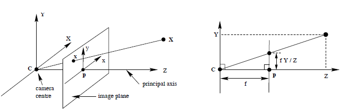
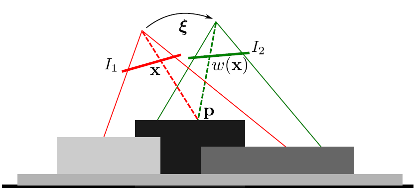

## 基础知识
### 相机模型
  相机模型描述了三维世界点到二维图像坐标点之间的映射，三维坐标到二维坐标的映射 $\pi$ 称为投影。表示为：
  $$ \pi : {\mathbb R}^3 \rightarrow {\mathbb R}^3 $$
  
  设2D图像点 $x$ 坐标为 $(x,y)$，对应的3D点为 ${\mathbf X}$，坐标为 $(X,Y,Z)$。有下列等式：
$$\begin{array}{c}
\pi(X,Y,Z)\rightarrow(x,y) \\
x = \frac{X \cdot f_x}{Z} + c_x \\
y = \frac{Y \cdot f_y}{Z} + c_y
\end{array}$$
  如果深度 $Z$ 和相机参数 $(f_x,f_y,c_x,c_y)$ 已知，像素点 $x$ 对应的3D坐标为：
$$\begin{array}{c}
\pi^{-1}(x,y,Z) \rightarrow (X,Y,Z) \\
X = \frac{x-c_x}{f_x}Z \\
Y = \frac{y-c_y}{f_y}Z \\
Z = Z
\end{array}$$
### 刚体变换
三维欧氏空间内的刚体变换保持向量的长度和夹角不发生变化，表示为：
$$g : {\mathbb R}^3 \rightarrow {\mathbb R}^3;  x \rightarrow g(x)$$
设空间点 $p$ 的其次坐标为 ${(x,y,z,1)}^T$，经过变换后的空间点 ${p}'= g(p) = ({x}',{y}',{z}',1)^T$
$$ g(p)= G\cdot p = \begin{pmatrix}
r_{11} & r_{12} & r_{13} & t_x \\
r_{21} & r_{22} & r_{23} & t_x \\
r_{31} & r_{32} & r_{33} & t_x \\
0 & 0 & 0 & 1 \end{pmatrix} \begin{pmatrix}
x \\ y \\ z \\ 1 \end{pmatrix}$$
有：

$$\begin{array}{c}
{x}' = r_{11}x + r_{12}y + r_{13}z + t_x \\
{y}' = r_{21}x + r_{22}y + r_{23}z + t_y \\
{z}' = r_{31}x + r_{32}y + r_{33}z + t_z
\end{array}$$

### 李代数求导
某空间点 $p(x,y,z)$ 经过一次变换 $T$ （对应李代数为 $\xi$），得到 ${p}' = Tp = ({x}',{y}',{z}')$。则变换后的点关于变换的导数为：
$$\begin{equation}\begin{aligned}\frac {\partial(Tp)}{\partial{\delta \xi}} &= \begin{pmatrix} I & -(Rp + t)^{\wedge} \end{pmatrix}  \\
&= \begin{pmatrix}  1 & 0 & 0 & 0 & {z}' & -{y}'\\
  0 & 1 & 0 & -{z}' & 0 & {x}'\\
  0 & 0 & 1 & {y}' & -{x}' & 0 \end{pmatrix}\end{aligned}\end{equation}$$
## 直接法公式推导
### 光度不变假设

点 $p$ 同时出现在图像 $I_1$ 和 $I_2$ 中，点 $p$ 投影在 $I_1$上的像素坐标为 $x$。给定一个相机的刚体变换 $\xi$，变换方程 $w(x)$ 计算在 $I_2$上的像素坐标，两者的灰度值应该一致，$I_1(x) - I_2(w(x)) = 0$.   
最小化光度误差：
$$\xi^* = arg min(I_2(w(\xi,x)) - I_1(x))^2$$
变换函数 $w(\xi,x)$ 定义为：
$$w(\xi,x) = \pi(g(G(\xi),\pi^{-1}(x,Z_1(x))))$$

### 线性化
存在多种等价的线性化方法，这里介绍两种，第一种每次迭代时在上次估计的附近线性化，称为Forward Additive Algorithm。第二种在一个固定的点附近线性展开，在每次迭代后只需用上次估计的变换更新输入图像，只需在初始的点附近线性化，节省了计算代价，点的雅可比矩阵是固定的，称为Forward Compositional Algorithm

#### Forward Additive Algorithm
  位姿参数增量 $\Delta \xi$ 连接到上一次的估计。$\xi_{k+1} = \log(\exp(\xi_k) \cdot \exp(\Delta\xi)) = \xi_k\oplus \Delta\xi$   
  误差方程为：
  $$r_i(\xi_{k+1}) = I_2(w(\xi_k\oplus \Delta\xi,x_i)) - I_1(x_i)$$
  线性化：
  $$r_{lin,i}(\xi_{k+1}) = r_i(\xi_k) + J_i(\xi_k)\Delta\xi$$
  残差 $r_i(\xi_k)$ 为：
  $$r_i(\xi_k) = I_2(w(\xi_k,x_i)) - I_1(x_i)$$
  根据链式法则，雅可比矩阵 $J_i(\xi_k)$ 可分解为：
  $$J_i(\xi_k) = J_IJ_w = J_IJ_{\pi}J_gJ_G$$   
  其中， $J_I$为像素在 x , y 方向的梯度， $J_{\pi}$ 为投影方程关与变换后的三维点的导数， $J_gJ_G$ 为变换后的三维点关于变换 $\xi$ 的导数。

  $p_i = (x,y,z)^T=\pi^{-1}(x_i,Z_1(x_i))$，${x}',{y}',{z}'$ 为 $p_i$ 转换后的3D坐标。
  $$J_I = \begin{pmatrix}\Delta I_{2,x} & \Delta I_{2,y}\end{pmatrix}$$

  $$J_{\pi} = \begin{pmatrix}
  f_x\frac 1{z'} & 0 & -f_x\frac { x'}{ z'^2} \\
  0 & f_y\frac 1{z'} & -f_y\frac {y'}{z'^2} \end{pmatrix}$$

  $$J_gJ_G = \begin{pmatrix}
  1 & 0 & 0 & 0 & {z}' & -{y}'\\
  0 & 1 & 0 & -{z}' & 0 & {x}'\\
  0 & 0 & 1 & {y}' & -{x}' & 0 \end{pmatrix}$$

  因此：
  $$J_IJ_w = \begin{pmatrix}\Delta I_{2,x} & \Delta I_{2,y}\end{pmatrix} \begin{pmatrix}
  f_x\frac1{z'} & 0 &-f_x\frac{x'}{z'^2} & -f_x\frac{x'y'}{z'^2} & f_x(1 + \frac{x'^2}{z'^2}) & -f_x\frac{y'}{z'} \\
  0 & f_y\frac1{z'} & -f_y\frac{y'}{z'^2} & -f_y(1+\frac{y'^2}{z'^2}) & f_y\frac{x'y'}{z'^2} & f_y\frac{x'}{z'}
   \end{pmatrix}$$   
雅可比矩阵 $J_w$在每次迭代过程中都会改变，因为由深度图 $Z_1$ 得到的点 $p_i$ 都要经过上一次估计 $\xi$ 变换。
#### Forward Compositional Algorithm
与Forward Additive Algorithm不同，Forward Compositional是针对变换后的像素坐标而不是估计位姿。
误差方程为：
$$r_i(\xi_{k+1}) = I_2(w(\xi_k,w(\Delta\xi,x_i))) - I_1(x_i)$$
线性化：
$$r_{lin,i}(\xi_{k+1}) = r_i(0) + J_i(0)\Delta\xi$$
残差 $r_i(\xi_k)$ 为：
$$r_i(0) = I_2(w(\xi_k,x_i)) - I_1(x_i)$$
根据链式法则，雅可比矩阵 $J_i(\xi_k)$ 可分解为：
$$J_i(0) = J_IJ_w = J_IJ_{\pi}J_gJ_G$$
在 $\Delta\xi = 0$ 附近线性化，简化了三维点的雅可比矩阵，因为 $G(0)$ 为单位阵，因此在每次迭代过程中三维点的雅可比矩阵是不变的。因此各雅可比矩阵的定义为：
$$ J_I = \begin{pmatrix}\Delta I_{2,x} & \Delta I_{2,y}\end{pmatrix}$$
$$J_{\pi} = \begin{pmatrix}
f_x\frac 1z & 0 & -f_x\frac x{z^2} \\
0 & f_y\frac 1z & -f_y\frac y{z^2} \end{pmatrix}$$
$$J_gJ_G = \begin{pmatrix}
1 & 0 & 0 & 0 & z & -y\\
0 & 1 & 0 & -z & 0 & x\\
0 & 0 & 1 & y & -x & 0 \end{pmatrix}$$
因此：
$$J_IJ_w = \begin{pmatrix}\Delta I_{2,x} & \Delta I_{2,y}\end{pmatrix} \begin{pmatrix}
f_x\frac 1z & 0 &-f_x\frac x{z^2} & -f_x\frac {xy}{z^2} & f_x(1 + \frac {x^2}{z^2}) & -f_x\frac yz \\
0 & f_y\frac 1z & -f_y\frac y{z^2} & -f_y(1+\frac {y^2}{z^2}) & f_y\frac{xy}{z^2}  & f_y\frac xy
 \end{pmatrix}$$   
 在计算得到雅可比矩阵后，就可以在每次迭代过程中通过求解法方程得到位姿增量：
 $$ J^TJ\delta_{\xi}=J^T\epsilon$$
 $\delta_{\xi}$ 为位姿增量， $\epsilon$ 为光度残差
 ## 光度误差+几何误差
 类似光度误差，对于深度图可以定义几何误差
 最小化几何误差：
 $$\xi^* = arg min(D_2(w(\xi,x)) - D_1(x))^2$$
这里的雅可比矩阵为：
$$J_i(0) = J_DJ_W - J_z$$
其中 $J_D$ 为深度图 x, y 方向的梯度， $J_W$ 为误差方程关于变换的导数与光度误差的 $J_W$一致， $J_z$ 为深度值(z)关于变换的导数，因此为三维点关于变换的雅可比矩阵的第三行。这里的几何误差类似与ICP的误差项。
## 代码实现
dvo_slam实现的是光度误差+深度误差的Dense VO
[https://github.com/tum-vision/dvo_slam](https://github.com/tum-vision/dvo_slam)
## 参考文献
[1] 高翔.等.视觉SLAM十四讲[M].中国工信出版集团      
[2] Odometry from RGB-D Cameras for Autonomous Quadrocopters (C. Kerl), Master's thesis, Technical University Munich, 2012.   
[3] Robust Odometry Estimation for RGB-D Cameras (C. Kerl, J. Sturm, D. Cremers), In International Conference on Robotics and Automation (ICRA), 2013.   
[4] Dense Visual SLAM for RGB-D Cameras (C. Kerl, J. Sturm, D. Cremers), In Proc. of the Int. Conf. on Intelligent Robot Systems (IROS), 2013.   
[5] Dense Continuous-Time Tracking and Mapping with Rolling Shutter RGB-D Cameras (C. Kerl, J. Stueckler, D. Cremers), In IEEE International Conference on Computer Vision (ICCV), 2015.
