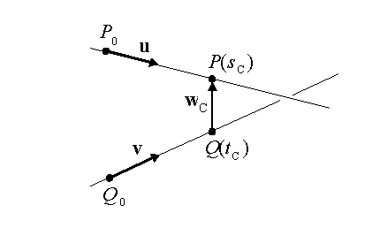
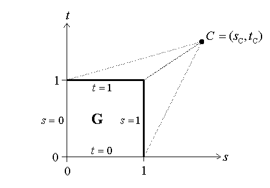
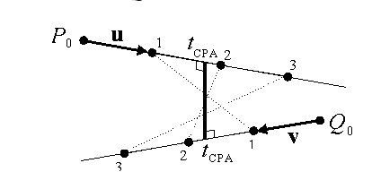

我们经常需要计算两个几何物体之间的最小距离，任意两个几何物体之间的欧式距离定义为它们之间任意两点的最小距离。对于两个几何体 $\mathbf{G_1}$ 和 $\mathbf{G_2}$，它们之间的距离定义为：
$$d(\mathbf{G_1}, \mathbf{G_2}) = \min_{P \in \mathbf{G_1}, Q \in \mathbf{G_2}} d(P, Q) $$   

求解两条直线之间的最短距离就是寻找两点，$P_C \in \mathbf{G_1}$， $Q_c \in \mathbf{G_2}$之间的距离最小，这时 $d(\mathbf{G_1},\mathbf{G_2}) = d(P_C, Q_C)$。

## 直线间的距离
假设两条直线
$$
\begin{array}{ll}
\mathbf{L_1}: P(s) = P_0 + s(P_1-P_0)=P_0 + s \mathbf{u} \\
\mathbf{L_2}: Q(s) = Q_0 + t(Q_1-Q_0)=Q_0 + t \mathbf{v}    
\end{array}
$$   
设 $\mathbf{w}(s,t) = P(s)-Q(t)$是两条直线上点之间的向量。我们希望找到对于所有的$s$ 和 $t$，向量$\mathbf{w}(s,t)$都有最小的长度。假设$\mathbf{L_1}$和$\mathbf{L_2}$ 点$P_c = P(s_C)$ 和 $Q_C=Q(t_C)$时最近，此时$\mathbf{w}(s_C,t_C)$是$\mathbf{w}(s,t)$ 的最小值。如果$\mathbf{L_1}$ 和 $\mathbf{L_2}$彼此不平行也不相交，这时$P_CQ_C$同时垂直于这两条直线,也就是向量$\mathbf{w_C} = w(s_C, t_C)$垂直于两条线的方向向量$\mathbf u$ 和$\mathbf v$, 等价于满足两个方程： $\mathbf u * \mathbf w_C = 0$和$\mathbf v * \mathbf w_C = 0$。 

 

向量$\mathbf W_C = P(S_C)-Q(t_C)=\mathbf W_0 + s_C \mathbf{u} - t_C \mathbf{v}$，这里$\mathbf{w_0} = P_0 - Q_0$，将其代入上述两个方程可以得到：
$$
\begin{array}{ll}
（\mathbf{u} \cdot \mathbf{u})s_C - (\mathbf{u} \cdot \mathbf{v})t_C = -\mathbf{u} \cdot \mathbf{w_0} \\
（\mathbf{v} \cdot \mathbf{u})s_C - (\mathbf{v} \cdot \mathbf{v})t_C = -\mathbf{v} \cdot \mathbf{w_0}   
\end{array}
$$  

让$a=\mathbf u \cdot \mathbf u, b = \mathbf u \cdot \mathbf v, c = \mathbf v \cdot \mathbf v,d= \mathbf u \cdot \mathbf w_0$，可以解得：   
$$
s_C = \frac{be-cd}{ac-b^2}
$$
$$
t_C = \frac{ae-bd}{ac-b^2}
$$
注意分母$ac-b^2 = {|\mathbf u|}^2 {|\mathbf v|}^2 - (|\mathbf{u}||\mathbf{v}|\cos \theta)^2 = (|\mathbf u||\mathbf v| \sin \theta)^2 \geq 0$永远非负。当为零时，两条直线平行，其之间的距离是常量。可以让$s_C=0$,得到$t_C= d/b=e/c$。   

求得$s_C$和$t_C$后，可以计算得到直线$\mathbf L_1$和直线$\mathbf L_2$上的两点$P_C$和$Q_C$，两点间的距离为：
$$
d(\mathbf L_1, \mathbf L_2) = |P(s_C)-Q(t_C)|=|(P_0-Q_0)+\frac{(be-cd)\mathbf u - (ae-bd)\mathbf v}{ac-b^2}|
$$
   
## 线段和射线间的距离

线段和射线间的最短距离点必须在线段或者射线上。用$P_0$,$P_1$两点来表示线段$\mathbf S_1 = [P_0,P_1]$，$P(s)=P_0+s(P_1-P_0)=P_0+s\mathbf u$ 这里 $0 \leq s \leq 1$。射线$\mathbf R_1$也可以由$P(s)$表示，这里$s\geq0$，类似地，线段$\mathbf S_2=[Q_0,Q_1]$可以由$\mathbf Q(t)$表示 $0 \leq t \leq 1$。   
求解线段或者射线之间的距离的第一步是先求解它们所在直线之间的距离。所以，我们首先对$\mathbf L_1$ 和 $\mathbf L_2$计算$s_C$和$t_C$，如果它们都在线段或者射线上，则它们就是距离最近的点。否则，我们需要找到新的点使得$\mathbf w(s,t) = P(s) - Q(t)$最小，等价于最小化${|\mathbf w|}^2 = \mathbf w \cdot \mathbf w = (\mathbf w_0 + s \mathbf u - t \mathbf v) \cdot (\mathbf w_0 + s \mathbf u - t \mathbf v)$，这是一个$s$和$t$的二次函数。实际上，${|\mathbf w|}^2$定义了在$(s,t)$平面上的抛物面，最低点在$\mathbf C = (s_C, t_C)$，在$(s,t)$平面上从$C$开始向任何方向都是严格递增的，但是当涉及到线段或者射线时，需要最小化$(s，t)$平面上的一个子区域$\mathbf G$，全局最低点有可能在$\mathbf G$外部。但是，这种情况下，最小值都会出现在$\mathbf G$的边界上，特殊情况下，$\mathbf G$边界的部分对$C$是可见的。也就是说有一个从$C$到边界点的直线在$\mathbf G$的外部，因此我们可以说$C$可以看见$\mathbf G$边界上的点。   

假设我们想得到两个线段$\mathbf S_1$和$\mathbf S_2$之间的最小距离。我们有$\mathbf G ={(s,t)|0 \leq s \leq 1 and 0 \leq t \leq 1} = [0,1]\times[0,1]$ 是一个单位四边形，正方形的四个边为$s=0,s=1,t=0,t=1$。 如果$\mathbf C = (s_C, t_C)$在$\mathbf G$外，则它最多可以看到$\mathbf G$的两条边。 如果$s_C < 0$，$\mathbf C$可以看到边$s=0$；如果$s_C > 1$，$\mathbf C$可以看到边$s=1$；$t_C$类似。很明显，如果$\mathbf C$不在 $\mathbf G$内，则最小一个，最多两个这些不等式成立，它们决定了最小化${|\mathbf w|}^2$时$\mathbf G$的候选边。

   

对于每个候选边，我们计算最小值在边上，在内部或者是终点。考虑$s=0$的边，这时${|\mathbf w|}^2 = (\mathbf w_0 - t \mathbf v)\cdot(\mathbf w_0 - t \mathbf v)$。对$t$求导得到：
$$
0 = \frac{d}{dt} {|\mathbf w|}^2 = -2\mathbf v \cdot (\mathbf w_0 - t\mathbf v)
$$
求得
$$
t_0 = \frac{\mathbf v \cdot \mathbf w_0}{\mathbf v \cdot \mathbf v}
$$
如果$0\leq t_0 \leq 1$,则$P(0)$ 和 $Q(t_0)$就是两个线段上的最邻近点。但是，如果$t_0$在边外边，则边的终点,(0,0)或者(0,1)是距离最小点；另外，我们需要进一步检查第二个可见边以防真正的最小值在它上边。   

## 碰撞距离

`Closet Point of Approach`指的是两个动态移动物体达到它们最接近距离时的位置。考虑两个该时间$t$动态变化的点$P(t)$和$Q(t)$。令$t=0$时刻的位置为$P_0$和$Q_0$；单位时间的速度向量为$\mathbf u$ 和 $\mathbf v$。两点的运动方程为$P(t)=P_0+t\mathbf u$和 $Q(t)=Q_0+t\mathbf v$，和直线的参数方程类似。但是这两个方程有共同的参数$t$。所以，在$t$时刻，两点的距离$d(t)=|P(t)-Q(t)|=|\mathbf w(t)|$,这里$\mathbf w(t)=\mathbf w_0 + t(\mathbf u - t \mathbf v)$， $\mathbf w_0 = P_0 - Q_0$。  

  
   

由于$d(t)$最小等价于$D(t)=d(t)^2$最小，可以计算得到：
$$
D(t)=\mathbf w(t) \cdot \mathbf w(t)=(\mathbf u - \mathbf v)\cdot (\mathbf u -\mathbf v)t^2 + 2\mathbf w_0 \cdot(\mathbf u - \mathbf v)t + \mathbf w_0 \cdot \mathbf w_0  
$$
对$t$求导得到：
$$
0=\frac{d}{dt}D(t)=2t[(\mathbf u - \mathbf v)\cdot (\mathbf u - \mathbf v)]+2 \mathbf w_0 \cdot(\mathbf u - \mathbf v)
$$

求解得到：
$$
t_{CPA}=\frac{-\mathbf w_0 \cdot (\mathbf u - \mathbf v)}{\vert \mathbf u - \mathbf v \vert ^2}
$$
如果 $|\mathbf u - \mathbf v| = 0$， 则这两个点以相同速度朝相同方向运动，将永远保持相同距离，所以我们可以用$t_{CPA}=0$。我们可以计算得到距离：
$$
d_{CPA}(P(t),Q(t))=|P(t_{CPA})-Q(t_{CPA})|
$$
注意，当$t_{CPA} <0$时，表示CPA已经在过去发生，两个跟踪点随时间将距离越来越远。   

## 代码实现

```
// Copyright 2001, 2012, 2021 Dan Sunday
// This code may be freely used and modified for any purpose
// providing that this copyright notice is included with it.
// There is no warranty for this code, and the author of it cannot
// be held liable for any real or imagined damage from its use.
// Users of this code must verify correctness for their application.
 


 
// Assume that classes are already given for the objects:
//    Point and Vector with
//        coordinates {float x, y, z;}
//        operators for:
//            Point   = Point ± Vector
//            Vector =  Point - Point
//            Vector =  Vector ± Vector
//            Vector =  Scalar * Vector
//    Line and Segment with defining points {Point  P0, P1;}
//    Track with initial position and velocity vector
//            {Point P0;  Vector v;}
//===================================================================
 

#define SMALL_NUM   0.00000001 // anything that avoids division overflow
// dot product (3D) which allows vector operations in arguments
#define dot(u,v)   ((u).x * (v).x + (u).y * (v).y + (u).z * (v).z)
#define norm(v)    sqrt(dot(v,v))  // norm = length of  vector
#define d(u,v)     norm(u-v)        // distance = norm of difference
#define abs(x)     ((x) >= 0 ? (x) : -(x))   //  absolute value
 


// dist3D_Line_to_Line(): get the 3D minimum distance between 2 lines
//    Input:  two 3D lines L1 and L2
//    Return: the shortest distance between L1 and L2
float
dist3D_Line_to_Line( Line L1, Line L2)
{
    Vector   u = L1.P1 - L1.P0;
    Vector   v = L2.P1 - L2.P0;
    Vector   w = L1.P0 - L2.P0;
    float    a = dot(u,u);         // always >= 0
    float    b = dot(u,v);
    float    c = dot(v,v);         // always >= 0
    float    d = dot(u,w);
    float    e = dot(v,w);
    float    D = a*c - b*b;        // always >= 0
    float    sc, tc;

    // compute the line parameters of the two closest points
    if (D < SMALL_NUM) {          // the lines are almost parallel
        sc = 0.0;
        tc = (b>c ? d/b : e/c);    // use the largest denominator
    }
    else {
        sc = (b*e - c*d) / D;
        tc = (a*e - b*d) / D;
    }

    // get the difference of the two closest points
    Vector   dP = w + (sc * u) - (tc * v);  // =  L1(sc) - L2(tc)

    return norm(dP);   // return the closest distance
}
//===================================================================


// dist3D_Segment_to_Segment(): get the 3D minimum distance between 2 segments
//    Input:  two 3D line segments S1 and S2
//    Return: the shortest distance between S1 and S2
float
dist3D_Segment_to_Segment( Segment S1, Segment S2)
{
    Vector   u = S1.P1 - S1.P0;
    Vector   v = S2.P1 - S2.P0;
    Vector   w = S1.P0 - S2.P0;
    float    a = dot(u,u);         // always >= 0
    float    b = dot(u,v);
    float    c = dot(v,v);         // always >= 0
    float    d = dot(u,w);
    float    e = dot(v,w);
    float    D = a*c - b*b;        // always >= 0
    float    sc, sN, sD = D;       // sc = sN / sD, default sD = D >= 0
    float    tc, tN, tD = D;       // tc = tN / tD, default tD = D >= 0

    // compute the line parameters of the two closest points
    if (D < SMALL_NUM) { // the lines are almost parallel
        sN = 0.0;         // force using point P0 on segment S1
        sD = 1.0;         // to prevent possible division by 0.0 later
        tN = e;
        tD = c;
    }
    else {                 // get the closest points on the infinite lines
        sN = (b*e - c*d);
        tN = (a*e - b*d);
        if (sN < 0.0) {        // sc < 0 => the s=0 edge is visible
            sN = 0.0;
            tN = e;
            tD = c;
        }
        else if (sN > sD) {  // sc > 1  => the s=1 edge is visible
            sN = sD;
            tN = e + b;
            tD = c;
        }
    }

    if (tN < 0.0) {            // tc < 0 => the t=0 edge is visible
        tN = 0.0;
        // recompute sc for this edge
        if (-d < 0.0)
            sN = 0.0;
        else if (-d > a)
            sN = sD;
        else {
            sN = -d;
            sD = a;
        }
    }
    else if (tN > tD) {      // tc > 1  => the t=1 edge is visible
        tN = tD;
        // recompute sc for this edge
        if ((-d + b) < 0.0)
            sN = 0;
        else if ((-d + b) > a)
            sN = sD;
        else {
            sN = (-d +  b);
            sD = a;
        }
    }
    // finally do the division to get sc and tc
    sc = (abs(sN) < SMALL_NUM ? 0.0 : sN / sD);
    tc = (abs(tN) < SMALL_NUM ? 0.0 : tN / tD);

    // get the difference of the two closest points
    Vector   dP = w + (sc * u) - (tc * v);  // =  S1(sc) - S2(tc)

    return norm(dP);   // return the closest distance
}
//===================================================================


// cpa_time(): compute the time of CPA for two tracks
//    Input:  two tracks Tr1 and Tr2
//    Return: the time at which the two tracks are closest
float
cpa_time( Track Tr1, Track Tr2 )
{
    Vector   dv = Tr1.v - Tr2.v;

    float    dv2 = dot(dv,dv);
    if (dv2 < SMALL_NUM)      // the  tracks are almost parallel
        return 0.0;             // any time is ok.  Use time 0.

    Vector   w0 = Tr1.P0 - Tr2.P0;
    float    cpatime = -dot(w0,dv) / dv2;

    return cpatime;             // time of CPA
}
//===================================================================


// cpa_distance(): compute the distance at CPA for two tracks
//    Input:  two tracks Tr1 and Tr2
//    Return: the distance for which the two tracks are closest
float
cpa_distance( Track Tr1, Track Tr2 )
{
    float    ctime = cpa_time( Tr1, Tr2);
    Point    P1 = Tr1.P0 + (ctime * Tr1.v);
    Point    P2 = Tr2.P0 + (ctime * Tr2.v);

    return d(P1,P2);            // distance at CPA
}
//===================================================================
```