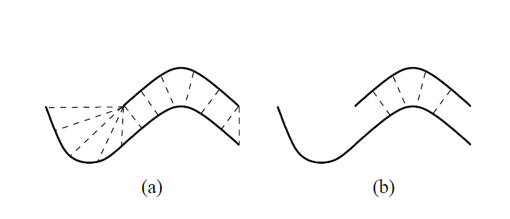

## 前言
ICP算法广泛应用于已知初始相对位姿的三维模型的几何对齐，通过在网格或点云上重复生成一致性点并最小化误差度量来迭代精化变换矩阵，一致性点对通过查找最邻近点生成，因此称作迭代最邻近点（ICP,Iterative Closest Point)。自从ICP算法提出以后，产生了许多基于ICP概念的变种方法。ICP算法可以分为六个步骤，每个步骤可以选择不同的策略：   
  - Selection   
  在一帧或者两帧点云中选择一些点集
  - Matching   
  在另外一帧中寻找与这些点匹配的采样点   
  - Weighting   
  计算对应点对的权重   
  - Rejecting   
  根据某些条件移除一些点对   
  - Error metric   
  选择误差度量方式
  - Minimizing   
  最小化误差
<!-- more -->
## 不同方法比较
### Selection of Points
  常用的采样方法有：
   - 均匀采样
   - 随机采样
   - 灰度梯度采样
   - 法向空间采样  

  **结论**：对于复杂物体，法向量分布较好的情况下，采样方法并不重要，收敛的性能也是相似的，但对于雕刻的平面(incised plane)，法向量在大部分地方方向是一致的，决定位姿六个参数变量的点处于刻沟的地方(groove)，法向空间采样可以ICP算法收敛。另外，当两帧点云重叠度较小时，同时对两帧点云进行此采样也会提升配准的效果。   

### Matching Points
ICP的第二步是一致性点对的寻找，查找策略有：
- 寻找最邻近点，使用k-d tree
- normal shooting:源点法向与目标平面的交点
- 将源点投影到目标点的深度图上，相机视线下的点
- 投影到深度图上，选择一个度量方式（点距离，灰度一致性）搜索最近的点   

**结论**：投影的方式收敛速度和时间更快些，但对于"incised plane"，最邻近点是唯一能正确收敛的策略。   

### Weighting of Pairs
- 常量权重
- 根据点对距离
- 根据法向夹角
- 根据扫描仪噪声影响   

**结论**：权重的影响对收敛速度影响很小且与数据高度相关   

### Rejecting Pairs
筛选一致性点对，提出局外点对
- 根据设置距离阈值
- 根据距离阈值删除最坏的10%的点对
- 根据点对距离的标准差筛选
- 根据两对一致性点对距离筛选
- 删除边界上的点对   

**结论**：筛选一致性点对能够增加正确率和稳定性，并不能加速收敛，但应该尽可能删除边界上的点，因为边界点的最邻近点通常不正确，如下图所示：
   

### Error Metrix and Minimizatiion
- point to point
- point to plane   

**结论**：point to plane 比 point to point效果好   

## 总结
- 使用法向空间采样点云
- 使用最邻近搜索（kdtree)方式查找一致性点对
- 不使用权重
- 移除边界上的点对，移除距离或者法向夹角大于一定阈值的点对
- 最小化点到平面的误差

## 参考文献
> Rusinkiewicz S , Levoy M . Efficient variants of the ICP algorithm[C]// Proceedings Third International Conference on 3-D Digital Imaging and Modeling. IEEE, 2002.
