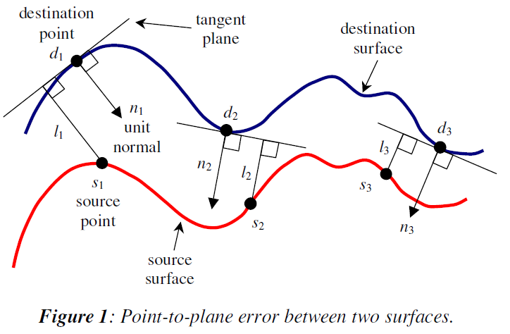

## 摘要
ICP算法中选择点到平面的误差度量比点到点的误差度量要收敛得更快，在ICP算法得每次迭代中最小化点到平面误差通常是一个标准非线性最小二乘问题，求解通常非常慢，但两帧点云之间的旋转角度较小时，可以近似为线性最小二乘问题。

## 算法原理及公式推导
 给定一个source点云和target点云，ICP算法在每次迭代中估计source点云和target点云之间的一致性点对集合，估计误差最小时的4x4刚体变换矩阵 $\mathbf M$，当使用点到平面的误差度量时，最小化的目标是每个源点和它对应目标点所在平面距离的平方和。设源点为 $\mathbf s_i = {(s_{ix},s_{iy},s_{iz},1)}^T$，对应的目标点为 $\mathbf d_i = {(d_{ix},d_{iy},d_{iz},1)}^T$，$\mathbf n_i = {(n_{ix},n_{iy},n_{iz},0)}^T$ 是 $\mathbf d_i$处的单位法向量，ICP每次迭代的目标是找到一个最佳的 $\mathbf M_{opt}$ 使：
  $$\mathbf M_{opt} = argmin\sum_i{((M\cdot s_i - d_i)\cdot n_i)}^2  (1)$$    
  
刚体变换矩阵 $\mathbf M$由一个旋转矩阵 $\mathbf R(\alpha ,\beta,\gamma)$ 和平移矩阵 $\mathbf T(t_x,t_y,t_z)$ 组成。
$$ \mathbf M = \mathbf R(\alpha ,\beta,\gamma)\cdot \mathbf T(t_x,t_y,t_z)$$
其中
$$\mathbf T(t_x,t_y,t_z) = \begin{pmatrix}
1 & 0 & 0 & t_x \\
0 & 1 & 0 & t_y \\
0 & 0 & 1 & t_z \\
0 & 0 & 0 & 1 \\ \end{pmatrix}$$

$$\mathbf R(\alpha,\beta,\gamma) = \begin{pmatrix}
r_{11} & r_{12} & r_{13} & 0 \\
r_{21} & r_{22} & r_{23} & 0 \\
r_{31} & r_{32} & r_{33} & 0 \\
0 & 0 & 0 & 1 \\ \end{pmatrix}$$
这里： $\alpha$，$\beta$，$\gamma$ 分别为x轴，y轴和z轴的旋转角度。
$$
\begin{aligned}
r_{11} &=\cos\gamma \cos\beta, \\
r_{12} &=-\sin\gamma \cos\alpha + \cos\gamma\sin\beta\sin\alpha, \\
r_{13} &=\sin\gamma\sin\alpha + \cos\gamma\sin\beta\sin\alpha, \\
r_{21} &=\sin\gamma\cos\beta, \\
r_{22} &=\cos\gamma\cos\alpha + \sin\gamma\sin\beta\sin\alpha, \\
r_{23} &=-\cos\gamma\sin\alpha + \sin\gamma\sin\beta\cos\alpha, \\
r_{31} &= -\sin\beta, \\
r_{32} &= \cos\beta\sin\alpha, \\
r_{33} &= \cos\beta\cos\alpha. \\
\end{aligned}
$$
### 线性化
当角度 $\theta \approx 0$时，得到 $\sin\theta \approx \theta$ 和 $\cos\theta \approx 1$，因此，当 $\alpha,\beta,\gamma \approx 0$时，
 $$\mathbf R(\alpha,\beta,\gamma) \approx
 \begin{pmatrix}
1 & \alpha\beta - \gamma & \alpha\gamma + \beta & 0 \\
\gamma & \alpha\beta\gamma + 1 & \beta\gamma - \alpha & 0 \\
-\beta & \alpha & 1 & 0 \\
0 & 0 & 0 & 1 \\
\end{pmatrix} \approx
\begin{pmatrix}
1 & -\gamma & \beta & 0 \\
\gamma & 1 & -\alpha & 0 \\
-\beta & \alpha & 1 & 0 \\
0 & 0 & 0 & 1 \\
\end{pmatrix}
$$
变换矩阵 $\mathbf M$ 近似为
$$\mathbf{\hat M} = \mathbf T(t_x,t_y,t_z) \cdot \mathbf{\hat R}(\alpha,\beta,\gamma) \\ =
\begin{pmatrix}
1 & -\gamma & \beta & t_x \\
\gamma & 1 & -\alpha & t_y \\
-\beta & \alpha & 1 & t_z \\
0 & 0 & 0 & 1 \\
\end{pmatrix}$$
最小化目标方程可以重写为：
  $$\mathbf {\hat M_{opt}} = argmin\sum_i{((\mathbf {\hat M}\cdot s_i - d_i)\cdot n_i)}^2$$
  $(\mathbf {\hat M}\cdot s_i - d_i)\cdot n_i$ 可以写为六个参数 $\alpha$，$\beta$，$\gamma$，$t_x$，$t_y$ 和 $t_z$的线性表达式：
  $$(\mathbf {\hat M}\cdot s_i - d_i)\cdot n_i =
  \left(\mathbf {\hat M} \cdot
  \begin{pmatrix}
  s_{ix} \\ s_{iy} \\ s_{iz} \\ 1 \\
  \end{pmatrix} - \begin{pmatrix}d_{ix} \\ d_{iy} \\ d_{iz} \\ 1 \\ \end{pmatrix}
  \right) \cdot \begin{pmatrix}n_{ix} \\ n_{iy} \\ n_{iz} \\ 0 \\ \end{pmatrix} \\
  = [(n_{iz}s_{iy}-n_{iy}s_{iz})\alpha + (n_{ix}s_{iz} - n_{iz}s_{ix})\beta + (n_{iy}s_{ix} - n_{ix}s_{iy})\gamma \\ + n_{ix}t_x + n_{iy}t_y + n_{iz}t_z] - \\ [n_{ix}d_{ix} + n_{iy}d_{iy}+n_{iz}d_{iz} - n_{ix}s_{ix} - n_{iy}s_{iy} - n_{iz}s_{iz}]
  $$
给出N对一致性点，可将表达式写成矩阵的形式：
$$\mathbf{Ax - b}$$
这里：
$$\mathbf b = \begin{pmatrix}
n_{1x}d_{1x} + n_{1y}d_{1y} + n_{1z}d_{1z} - n_{1x}s_{1x} - n_{1y}s_{1y} - n_{1z}s_{1z} \\
n_{2x}d_{2x} + n_{2y}d_{2y} + n_{2z}d_{2z} - n_{2x}s_{2x} - n_{2y}s_{2y} - n_{2z}s_{2z} \\
\vdots \\
n_{Nx}d_{Nx} + n_{Ny}d_{Ny} + n_{Nz}d_{Nz} - n_{Nx}s_{Nx} - n_{Ny}s_{Ny} - n_{Nz}s_{Nz} \\
 \end{pmatrix}$$

 $$\mathbf x = {(\alpha \quad \beta \quad \gamma \quad t_x \quad t_y \quad t_z)}^T$$   

 $$\mathbf A = \begin{pmatrix}
 a_{11} & a_{12} & a_{13} & n_{1x} & n_{1y} & n_{1z} \\
 a_{21} & a_{22} & a_{23} & n_{2x} & n_{2y} & n_{2z} \\
 \vdots & \vdots & \vdots & \vdots & \vdots & \vdots \\
  a_{N1} & a_{N2} & a_{N3} & n_{Nx} & n_{Ny} & n_{Nz} \\
\end{pmatrix}$$
这里：
$$
\begin{array}{c}
a_{i1} = n_{iz}s{iy} - n_{iy}s_{iz} \\
a_{i2} = n_{ix}s{iz} - n_{iz}s_{ix} \\
a_{i3} = n_{iy}s{ix} - n_{ix}s_{iy}
\end{array}
$$
因此：
  $$min\sum_i{((\mathbf {\hat M}\cdot s_i - d_i)\cdot n_i)}^2 = min{|\mathbf{Ax-b}|}^2$$
通过解方程 $\mathbf{Ax=b}$ 可以求得最佳的变换矩阵 $\mathbf {\hat M_{opt}}$
## 代码实现
pcl配准模块实现了point to plane lls，参考transformation_estimation_point_to_plane_lls.hpp ，在实际实现时，为了提高计算的数值稳定性通常先将点云归一化，再进行配准。
~~~
Matrix6d ATA;
Vector6d ATb;
ATA.setZero ();
ATb.setZero ();

// Approximate as a linear least squares problem
while (source_it.isValid () && target_it.isValid ())
{
  if (!pcl_isfinite (source_it->x) ||
      !pcl_isfinite (source_it->y) ||
      !pcl_isfinite (source_it->z) ||
      !pcl_isfinite (target_it->x) ||
      !pcl_isfinite (target_it->y) ||
      !pcl_isfinite (target_it->z) ||
      !pcl_isfinite (target_it->normal_x) ||
      !pcl_isfinite (target_it->normal_y) ||
      !pcl_isfinite (target_it->normal_z))
  {
    ++target_it;
    ++source_it;    
    continue;
  }

  const float & sx = source_it->x;
  const float & sy = source_it->y;
  const float & sz = source_it->z;
  const float & dx = target_it->x;
  const float & dy = target_it->y;
  const float & dz = target_it->z;
  const float & nx = target_it->normal[0];
  const float & ny = target_it->normal[1];
  const float & nz = target_it->normal[2];

  double a = nz*sy - ny*sz;
  double b = nx*sz - nz*sx;
  double c = ny*sx - nx*sy;

  //    0  1  2  3  4  5
  //    6  7  8  9 10 11
  //   12 13 14 15 16 17
  //   18 19 20 21 22 23
  //   24 25 26 27 28 29
  //   30 31 32 33 34 35

  ATA.coeffRef (0) += a * a;
  ATA.coeffRef (1) += a * b;
  ATA.coeffRef (2) += a * c;
  ATA.coeffRef (3) += a * nx;
  ATA.coeffRef (4) += a * ny;
  ATA.coeffRef (5) += a * nz;
  ATA.coeffRef (7) += b * b;
  ATA.coeffRef (8) += b * c;
  ATA.coeffRef (9) += b * nx;
  ATA.coeffRef (10) += b * ny;
  ATA.coeffRef (11) += b * nz;
  ATA.coeffRef (14) += c * c;
  ATA.coeffRef (15) += c * nx;
  ATA.coeffRef (16) += c * ny;
  ATA.coeffRef (17) += c * nz;
  ATA.coeffRef (21) += nx * nx;
  ATA.coeffRef (22) += nx * ny;
  ATA.coeffRef (23) += nx * nz;
  ATA.coeffRef (28) += ny * ny;
  ATA.coeffRef (29) += ny * nz;
  ATA.coeffRef (35) += nz * nz;

  double d = nx*dx + ny*dy + nz*dz - nx*sx - ny*sy - nz*sz;
  ATb.coeffRef (0) += a * d;
  ATb.coeffRef (1) += b * d;
  ATb.coeffRef (2) += c * d;
  ATb.coeffRef (3) += nx * d;
  ATb.coeffRef (4) += ny * d;
  ATb.coeffRef (5) += nz * d;

  ++target_it;
  ++source_it;    
}
ATA.coeffRef (6) = ATA.coeff (1);
ATA.coeffRef (12) = ATA.coeff (2);
ATA.coeffRef (13) = ATA.coeff (8);
ATA.coeffRef (18) = ATA.coeff (3);
ATA.coeffRef (19) = ATA.coeff (9);
ATA.coeffRef (20) = ATA.coeff (15);
ATA.coeffRef (24) = ATA.coeff (4);
ATA.coeffRef (25) = ATA.coeff (10);
ATA.coeffRef (26) = ATA.coeff (16);
ATA.coeffRef (27) = ATA.coeff (22);
ATA.coeffRef (30) = ATA.coeff (5);
ATA.coeffRef (31) = ATA.coeff (11);
ATA.coeffRef (32) = ATA.coeff (17);
ATA.coeffRef (33) = ATA.coeff (23);
ATA.coeffRef (34) = ATA.coeff (29);

// Solve A*x = b
Vector6d x = static_cast<Vector6d> (ATA.inverse () * ATb);
~~~
