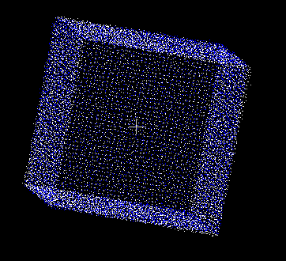

NDT（正态分布变换）是一种将点云表面表示为正态分布函数，通过最大化点到目标点表面的概率来估计两个点云之间刚体变换的配准方法，与ICP类似，也需要迭代进行，不同之处在于ICP的代价函数是点到点（点到面）之间的距离，而NDT的代价函数是点在目标表面上的概率。

## 原理
通过传感器得到的点云可以看作物体表面的空间采样点，表面可以用概率密度函数来表示，例如正态分布。算法首先将点云按体素划分，对于每个体素计算概率密度函数，如果是正态分布的话，需要计算的参数为体素内点的均值和方差。假设参考帧表面点是由D维正态随机过程产生，测量值$\vec{x}$的概率为：
$$ 
p(\vec{x}) = \frac{1}{(2\pi)^{D/2}\sqrt{|\Sigma|}}exp \left(-\frac{(\vec{x} - \vec{\mu})^T\Sigma^{-1}(\vec{x} - \vec{\mu})}{2}\right) \tag{6.1} 
$$
均值和方差为：
$$
\vec\mu = \frac{1}{m}\sum_{k=1}^{m}\vec{y}_k \tag{6.2}
$$
$$
\Sigma = \frac{1}{m-1}\sum_{k=1}^{m}(\vec{y}_k - \vec{\mu})(\vec{y}_k - \vec{\mu})^T \tag{6.3}
$$

NDT配准的目标是找到当前帧的位姿能够最大化当前帧的点在参考帧表面上的概率。优化的参数是位姿$\vec{p}$, 当最大化似然概率时得到最佳的位姿参数。
$$
\Psi = \prod_{k=1}^np(T(\vec{p},\vec{x}_k)) \tag{6.5}
$$
等同于最小化负对数概率
$$
-\log\Psi = -\sum_{k=1}^{n}\log\left(p(T(\vec{p},\vec{x}_k))\right) \tag{6.6}
$$
NDT混合采用了正态分布和均匀分布
$$
\vec{p}(\vec{x}) = c_1\exp\left(-\frac{(\vec{x}-\vec{\mu})^T\Sigma^{-1}(\vec{x}-\vec{\mu})}{2} +  c_2p_0\right) \tag{6.7}
$$
对于像 $\bar{p}(x) = -\log(c_1\exp(-x^2/(2\sigma^2)) + c_2)$ 这样的对数似然函数可以用高斯函数近似 $\bar{p}(x) = d_1 \exp(-d_2x^2/(2\sigma^2)) + d_3$。 当 $x = 0, \sigma, \infty$ 时，可以计算得到 $d_3, d_1, d_2$：
$$
\begin{array}{l}d_3 = -\log(c_2) \\
d_1 = -\log(c_1 + c_2) - d_3 \\
d_2 = -2\log((-log(c_1\exp(-1/2) + c_2) - d_3)/d_1)\end{array} \tag{6.8}
$$
点在目标点云表面上的概率为：
$$
\bar{p}(x) = -d_1 \exp\left(-\frac{d_2}{2}(\vec{x} - \vec{\mu})^T\Sigma^{-1}(\vec{x} - \vec{\mu})\right) \tag{6.9}
$$

参数向量的评价函数为：
$$
s(\vec{p}) =  \sum_{k=1}^n\bar{p}\left(T(\vec{p},\vec{x}_k)\right) \tag{6.10}
$$

令$\vec{x}_k^{‘} = T(\vec{p},\vec{x}_k) - \vec{\mu}_k$,评价函数的梯度向量和黑塞矩阵为：
$$
g_i = \frac{\delta{s}}{\delta{p}_i} = \sum_{k=1}^nd_1d_2\vec{x}_k^{'T}\Sigma_k^{-1}\frac{\delta{s}}{\delta{p}}\exp(\frac{-d_2}{2}\vec{x}_k^{'T}\Sigma_k^{-1}\vec{x}_k^{'} \tag{6.12}
$$

$$
H_{ij} = \frac{\delta^2s}{\delta{p_i}\delta{p_j}} = \\
\sum_{k=1}^nd_1d_2\exp(\frac{-d_2}{2}\vec{x}_k^{'T}\Sigma_k^{-1}\vec{x}_k^{'})\left(-d_2(\vec{x}_k^{'T}\Sigma_k^{-1}\frac{\delta\vec{x}_k^{'}}{\delta{p_i}})(\vec{x}_k^{'T}\Sigma_k^{-1}\frac{\delta\vec{x}_k^{'}}{\delta{p_j}}) + \\ 
\vec{x}_k^{'T}\Sigma_k^{-1}\frac{\delta^2\vec{x}_k^{'}}{\delta{p_i}\delta{p_j}} + \\ 
{\frac{\delta\vec{x}_k^{'}}{\delta{p_j}}^T}\Sigma_k^{-1}\frac{\delta\vec{x}_k^{'}}{\delta{p_i}}\right) \tag{6.13}
$$

我们可以使用牛顿法来优化参数向量$\vec{p}$，通过迭代求解方程$H\Delta\vec{p} = -\vec{g}$得到更新的参数增量$\Delta\vec{p}$，然后更新参数向量：
$$
\vec{p} = \vec{p} + \Delta\vec{p} * a
$$
这里$a$为步长，可通过线搜索方式确定或者默认设置为1。 NDT算法流程如下图所示：

## 3D NDT
对于3D NDT算法，参数向量为六维向量，包含三个平移、三个旋转，若用欧拉角表示旋转：
$$
\vec{p}_6 = {[t_x,t_y,t_z,\phi_x,\phi_y,\phi_z]}^T
$$
采用z-y-x的欧拉角顺序，3D变换方程为：
$$
\begin{aligned}
T_E(\vec{p_6},\vec{x}) &=R_xR_yR_z\vec{x} + \vec{t} \\
 &= \begin{bmatrix} c_yc_z & -c_ys_z & s_y \\
c_xs_z + s_xs_ys_z & c_xc_z - s_xs_ys_z & -s_xc_y \\
s_xs_z - c_xs_yc_z & c_xs_ys_z + s_xc_z & c_xc_y \\ \end{bmatrix}
+ \begin{bmatrix}t_x \\ t_y \\ t_z \end{bmatrix}\\
\end{aligned} \tag{6.17}
$$

雅克比矩阵为：
$$
J_E = \begin{pmatrix}
1 & 0 & 0 & 0 & c & f \\
0 & 1 & 0 & a & d & g \\
0 & 0 & 1 & b & e & h \\
 \end{pmatrix} \tag{6.18}
$$

这里：

$$
\begin{aligned}
a &= x_1(-s_xs_z+c_xs_yc_z) + x_2(-s_xc_z-c_xs_ys_z)+x_3(-c_xc_y)\\
b &= x_1(c_xs_z+s_xs_ys_z)+x_2(-s_xs_ys_z+c_xc_z) + x_3(-s_xc_y)\\
c &= x_1(-s_yc_z)+x_2(s_ys_z)+x_3(c_y)\\
d &= x_1(s_xc_yc_z)+x_2(-s_xc_ys_z) + x_3(s_xs_y)\\
e &= x_1(-c_xc_yc_z)+x_2(c_xc_ys_z) + x_3(-c_xs_y)\\
f &= x_1(-c_ys_z)+x_2(-c_yc_z)\\
g &= x_1(c_xc_z-s_xs_ys_z)+x_2(-c_xs_z-s_xs_yc_z)\\
h &= x_1(s_xc_z+c_xs_ys_z)+x_2(c_xs_yc_z-s_xs_z)\\
\end{aligned} \tag{6.19}
$$

二阶梯度矩阵是一个18x6的矩阵：
$$
H_E = \begin{bmatrix}
\vec{H}_{11} & \cdots & \vec{H}_{16} \\
\vdots & \ddots & \vdots \\
\vec{H}_{61} & \cdots & \vec{H}_{66}
\end{bmatrix} = \begin{bmatrix}
\vec{0} & \vec{0} & \vec{0} & \vec{0} & \vec{0} & \vec{0} \\
\vec{0} & \vec{0} & \vec{0} & \vec{0} & \vec{0} & \vec{0} \\
\vec{0} & \vec{0} & \vec{0} & \vec{0} & \vec{0} & \vec{0} \\
\vec{0} & \vec{0} & \vec{0} & \vec{a} & \vec{b} & \vec{c} \\
\vec{0} & \vec{0} & \vec{0} & \vec{b} & \vec{d} & \vec{e} \\
\vec{0} & \vec{0} & \vec{0} & \vec{c} & \vec{e} & \vec{f} \\
\end{bmatrix} \tag{6.20}
$$

这里：
$$
\begin{aligned}
\vec{a} &= \begin{bmatrix} 0 \\x_1(-c_xs_z-s_xs_yc_z)+x_2(-c_xc_z+s_xs_ys_z)+x_3(s_xc_y) \\ x_1(-s_xs_z+c_xs_yc_z)+x_2(-c_xs_ys_z)+x_3(-c_xc_y)  \end{bmatrix} \\

\vec{b} &= \begin{bmatrix}0 \\ x_1(c_xc_yc_z)+x_2(-c_xc_yc_z)+x_3(c_xs_y)\\ x_1(s_xc_yc_z)+x_2(-s_xc_ys_z)+x_3(s_xs_y)\\ \end{bmatrix}\\

\vec{c} &= \begin{bmatrix}0 \\ x_1(-s_xc_z-c_xs_ys_z)+x_2(-s_xs_z-c_xs_yc_z) \\x_1(c_xc_z-s_xs_ys_z)+x_2(-s_xs_yc_z-c_xs_z) \end{bmatrix} \\

\vec{d} &= \begin{bmatrix}x_1(-c_yc_z)+x_2(c_ys_z)+x_3(-s_y) \\ x_1(-s_xs_yc_z)+x_2(s_xs_ys_z)+x_3(s_xc_y) \\x_1(c_xs_yc_z)+x_2(-c_xs_ys_z)+x_3(-c_xc_y) \\ \end{bmatrix} \\

\vec{e} &= \begin{bmatrix}x_1(s_ys_z)+x_2(s_yc_z)\\x_1(-s_xc_ys_z)+x_2(-s_xc_yc_z)\\ x_1(c_xc_ys_z)+x_2(c_xc_yc_z)\\ \end{bmatrix} \\

\vec{f} &= \begin{bmatrix}x_1(-c_yc_z)+x_2(c_ys_z) \\x_1(-c_xs_z-s_xs_yc_z)+x_2(-c_xc_z+s_xs_ys_z)\\ x_1(-s_xs_z+c_xs_yc_z)+x_2(-c_xs_ys_z-s_xc_z)\\ \end{bmatrix} \\
\end{aligned} \tag{6.21}
$$

## 实验
PCL里实现了ndt算法，另外还用了线搜索方法寻找步长，原理可参考文献[2][3],从用模拟数据和实际数据测试结果来看，NDT整体的效果还是比较不错的，不过耗时上并没有比ICP有太大优势，NDT也需要搜索临近的体素进行迭代优化。模拟的立方体边长10m, 点云大小为9602，体素大小为0.25m，真实位姿为（1.0，,1.0,1.0,0.1,0.2，,0.2）给定初始位姿为单位阵，ndt经过18次迭代收敛，耗时0.652s。
