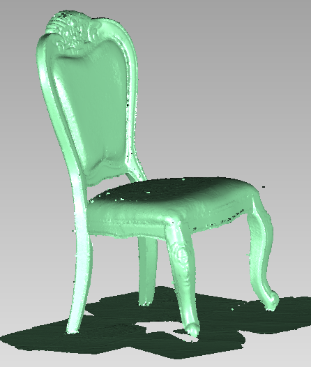
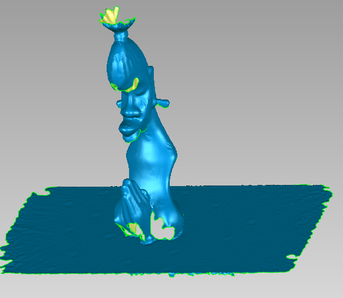
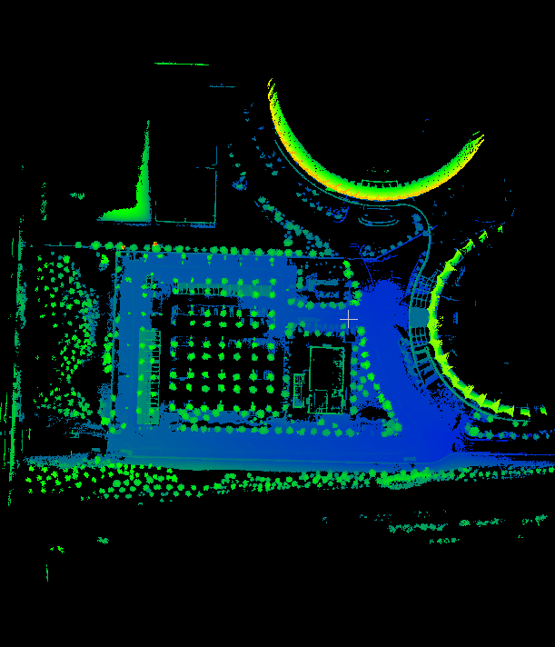
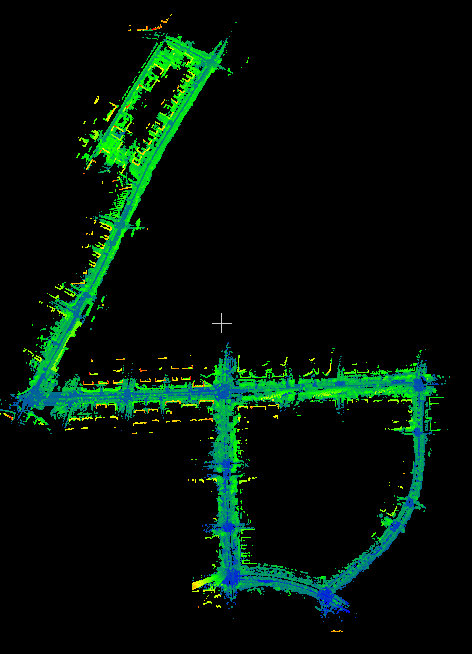
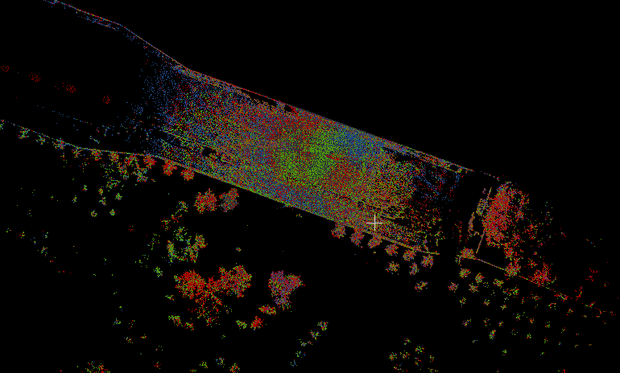

## 孟志立

 **电话:** 13006191397   

  **邮箱:** mengzhili_whu@163.com   

 **方向:** 标定/定位/建图 

###  教育经历   

---

**武汉大学**  地图学与地理信息系统 硕士  2014.09-2017.06   

**郑州大学** 地理信息系统 本科  2010.09-2014.06   

###  专业技能

---

- 编程语言： C/C++ Python Matlab
- 开发工具： Linux ROS CMake Git
- 知识储备： 传感器标定、融合定位、激光SLAM、多视图几何、优化库（ceres, gtsam, g2o)、点云配准、卡尔曼滤波、ADASIS V3
- 英语等级： CET-6 

###  工作经历    

---

**激光SLAM算法工程师**  北京禾多科技有限公司 2019.05-至今

- 多传感器融合定位算法开发（LiDAR+IMU+Wheel+GNSS)
- 激光建图算法开发，多地图融合算法开发
- 多传感器标定算法开发（multi-lidar IMU)
- 负责千寻、北汽v2x、南京自主泊车多个项目中的标定、定位和建图工作
  
**点云算法工程师** 武汉尺子科技有限公司  2018.01-2019.05
- RGBD SLAM
- 点云去噪平滑融合重建

**C++开发工程师**　北京吉威时代软件技术有限公司（武汉研究院）  2017.07-2018.01   
- 开发和维护GIS基础平台
  
###  项目经历

---

- **千寻车辆改装及自动驾驶软件开发项目**   
  负责工作：   
  1. 10km演示路线多次采集点云数据建图（园区、城市道路、地下停车场）
  2. 激光融合定位模块开发，位置精度10cm，角度误差0.2度
  3. 6个livox horizon激光雷达标定， 相机激光雷达标定
- **高精地图重构（EHR) 软件开发项目**   
   ADASIS V3地图消息解析

- **结构光手持三维扫描仪产品开发**    
  负责工作：   
  1. RGBD匹配算法研发（特征点、Dense、ICP）
  2. 实现点云去噪平滑TSDF融合相关算法

- **机载LiDAR波形数据分析及应用**（在校）     
  主要工作：
  1. LAS1.3波形数据文件读写，实现基于混合高斯模型的波形数据分解以及LM优化
  2. 实现一种多级加权曲面点云滤波方法，基于波形参数和几何特征的点云决策树分类

  论文：**机载激光雷达波形数据横向高斯分解方法[J]. 孟志立,徐景中.  武汉大学学报(信息科学版). 2018(01)**   
  专利：**一种机载LiDAR波形数据分解方法** 

###  成果展示   

---

- 博客： [https://zhilimeng.github.io](https://zhilimeng.github.io)

     

RGBD SLAM

     

LiDAR SLAM

     

Multi-LiDAR Calibration

