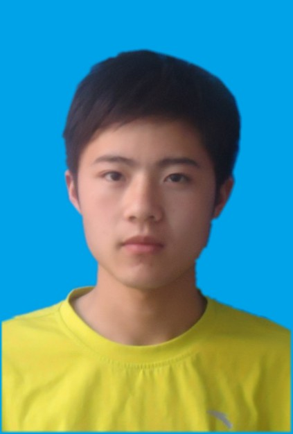

#### 孟志立

### 联系方式
**电话:** 13006191397    
**邮箱:** mengzhili_whu@163.com
### 工作方向
slam算法/点云算法/三维重建
### 个人信息
- 2014.09-2017.06 武汉大学 遥感信息工程学院 地图学与地理信息系统 硕士
- 2010.09-2014.06 郑州大学 水利与环境学院 地理信息系统 本科
- 英语等级： CET6 543
- 荣誉奖励： 2011-2012 国家励志奖学金 2012-2013 校三等奖学金 2015-2016 研究生二等学业奖学金 优秀硕士毕业论文
- Github: [https://github.com/zhilimeng](https://github.com/zhilimeng)
- 博客： [https://zhilimeng.github.io](https://zhilimeng.github.io)
### 个人技能
- 熟练掌握C\C++，熟悉Matlab,熟悉标准库和Boost，熟悉Git,SVN和CMake
- 熟悉多视图几何基本原理，常见优化方法，熟悉常见开源SLAM
- 熟练使用opencv,pcl,g2o,cgal等开源库
- 熟悉点云滤波、配准、融合相关算法
- 良好的英文文献阅读能力，研究和学习能力
### 工作经历
- 武汉尺子科技有限公司 点云算法工程师 2018.01-至今
- 北京吉威时代软件技术有限公司（武汉研究院） C++研发工程师 2017.07-2017.12
### 项目经历
- **结构光手持三维扫描仪项目**   
  项目描述：
   基于结构光的三维重建系统，包括硬件和软件，软件主要包括标定、结构光编解码、在线跟踪、离线优化、点云处理，网格处理等模块   
  负责工作：   
  1. RGBD VO算法实现及优化（特征点、Dense、ICP）
  2. 离线优化算法实现
  3. 实现点云去噪平滑融合相关算法

  开源实现：[dvo-slam-gicp](https://github.com/zhilimeng/dvo_slam_gicp)
- **基础平台自主化项目**   
  项目描述：开发和维护公司GIS平台和影像处理平台的基础类库   
  负责工作：地图业务方向，地图矢量渲染代码维护、开发、效率优化
- **机载LiDAR波形数据分析及应用**   
  项目描述：机载LiDAR波形数据分解及在地形重建中的应用   
  主要工作：
  1. LAS1.3波形数据文件读写，实现基于混合高斯模型的波形数据分解以及LM优化算法
  2. 实现一种多级加权曲面点云滤波方法，基于波形参数和几何特征的点云决策树分类

  论文：**机载激光雷达波形数据横向高斯分解方法[J]. 孟志立,徐景中.  武汉大学学报(信息科学版). 2018(01)**   
  专利：**一种机载LiDAR波形数据分解方法**   
  工具：[波形分解可视化工具](https://github.com/zhilimeng/LASWaveViewer)
### 自我评价
- 适应能力强，积极乐观，热爱生活，热爱运动
- 独立思考，较好的学习能力和抗压能力，强烈的好奇心和求知欲
